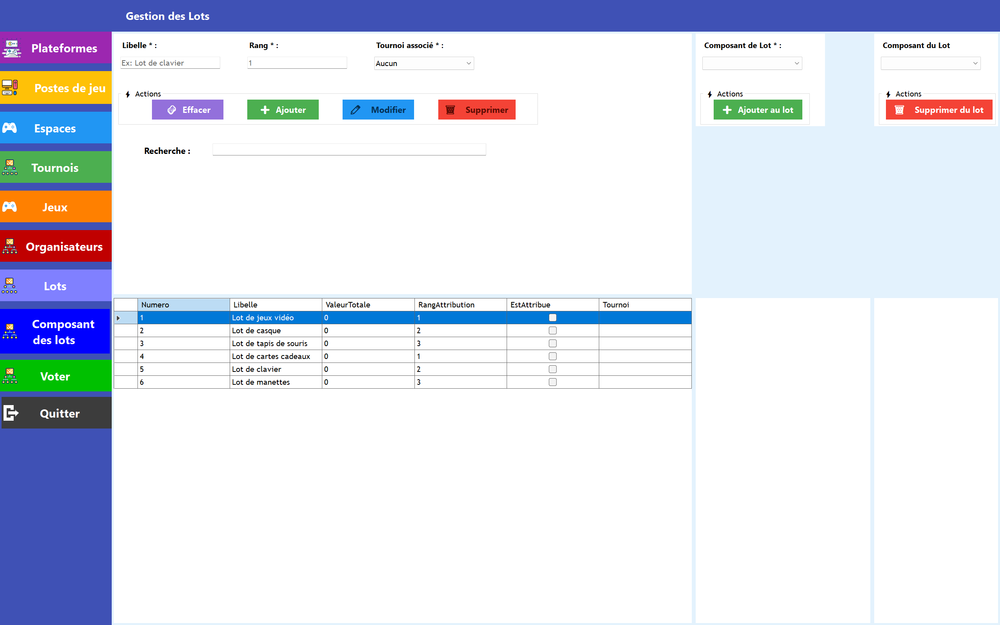
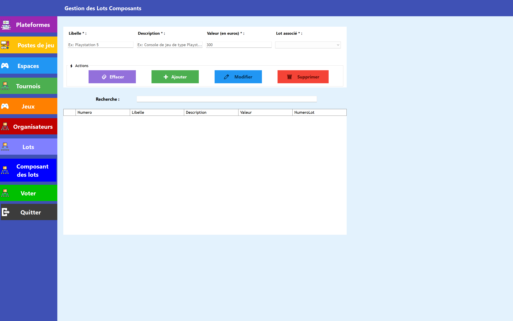

# 🎪 Festival Organisateur

Application de bureau **Windows Forms** développée en **C#** dans le cadre d'un BTS SIO Option SLAM (2025-2026).

Elle permet la gestion complète d'un festival : organisateurs, espaces, tournois, jeux, plateformes, lots et système de vote.

> ⚠️ Projet en cours de développement — versions alpha uniquement, ne pas déployer en production.

---

## 📋 Sommaire

- [Fonctionnalités](#-fonctionnalités)
- [Architecture](#-architecture)
- [Modèle de données](#-modèle-de-données)
- [Gestion des rôles](#-gestion-des-rôles)
- [Prérequis](#-prérequis)
- [Installation & Migrations](#-installation--migrations)
- [Contributeurs](#-contributeurs)
- [Releases](#-releases)

---

## ✨ Fonctionnalités

### 👤 Organisateurs
- Authentification avec hashage du mot de passe (BCrypt)
- Création et gestion des comptes organisateurs
- Gestion des rôles et permissions par module

### 🏟️ Espaces
- Création et gestion des espaces du festival (nom, description, superficie, capacité max)
- Statut des espaces associés à des tournois

### 🎮 Jeux & Plateformes
- Ajout et gestion des jeux (titre, éditeur, année de sortie, PEGI, description)
- Gestion des plateformes
- Association des jeux aux plateformes

### 🏆 Tournois
- Création et suivi des tournois (date, durée prévue, nb participants, statut)
- Plusieurs tournois peuvent avoir lieu simultanément dans des espaces différents
- Indication si un tournoi est en cours sur un poste de jeu

### 🖥️ Postes de jeu
- Gestion des postes de jeu associés aux espaces et plateformes
- Suivi de l'état fonctionnel de chaque poste

### 🎁 Lots
- Création et gestion des lots (libellé, valeur totale, rang d'attribution)
- Ajout de composants de lot (libellé, description, valeur)
- Ajout automatique de lots dans le programme
- Attribution des lots aux tournois

### 🗳️ Système de vote
- Soumission de jeux au vote avec période configurable (date début / date fin)
- Classement des binômes (jeu, plateforme) les plus votés
- Gestion des votes par joueur

### 👥 Joueurs
- Inscription des joueurs (pseudo, email, nom, prénom)
- Participation aux tournois avec rang, évaluation, commentaire et score final

---

## 🏗️ Architecture

Le projet suit une **architecture en couches** afin de séparer clairement les responsabilités et faciliter la maintenance.

```
Festival_Organisateur/
├── ApplicationUi/              # Interface utilisateur (WinForms)
├── ApplicationUI.TestUnits/    # Tests unitaires
├── Lib_Entities/               # Entités métier (POCO)
├── Lib_Metier/                 # DbContext EF Core, configurations, migrations
├── Lib_Services/               # Logique métier, interfaces, validations
└── Documentation/              # Captures d'écran & documents
```

### Relations entre les couches

```
ApplicationUI → Lib_Services → Lib_Entities
               Lib_Metier   → Lib_Entities
```

### Détail des couches

**`Lib_Entities`** — Entités métier  
Contient uniquement les classes métier, chacune correspondant à une table de la base de données.

**`Lib_Metier`** — Accès aux données (EF Core)  
Contient le `DbContext`, les classes de configuration EF Core (`XxxConf.cs`) définissant les clés primaires, relations et contraintes, ainsi que le dossier `Migrations`.

**`Lib_Services`** — Logique métier  
Contient les interfaces (`IxxxService`) et leurs implémentations. Centralise les règles métier et les accès EF Core.

**`ApplicationUI`** — Interface utilisateur  
Contient la `FormMain`, les `UserControls` par module et la gestion des droits d'accès.

### Stack technique

| Technologie | Usage |
|---|---|
| C# / WinForms | Interface utilisateur |
| Entity Framework Core | ORM |
| SQLite | Base de données |
| BCrypt | Hashage des mots de passe |

### Packages NuGet

- `Microsoft.EntityFrameworkCore`
- `Microsoft.EntityFrameworkCore.Sqlite`
- `Microsoft.EntityFrameworkCore.Tools`
- `Microsoft.EntityFrameworkCore.Design`

---

## 🗄️ Modèle de données

Le schéma UML complet est disponible dans le dossier [`Documentation/`](./Documentation/).

Les entités principales sont : `Organisateur`, `Role`, `Joueur`, `Jeu`, `Plateforme`, `Tournoi`, `Espace`, `Poste_Jeu`, `Lot`, `LotComposant`, `SoumisVote`, `Voter`, `Participer`.

---

## 🔐 Gestion des rôles

Quatre rôles ont été définis dans l'application :

| Rôle | CRUD | Consultation |
|---|---|---|
| **Administrateur** | Toutes les tables | — |
| **Gestionnaire du stock** | Lot, LotComposant | Tournoi, Jeu, Espace, PosteJeu, Plateforme |
| **Gestionnaire de l'espace** | Espace, PosteJeu, Tournoi | Plateforme, Jeu, Participer |
| **Gestionnaire des tournois** | Tournoi, Participer, SoumisVote | Espace, PosteJeu, Plateforme, Jeu, Lot, Voter |

---

## 🛠️ Prérequis

- [.NET 8+](https://dotnet.microsoft.com/download)
- [Visual Studio 2022+](https://visualstudio.microsoft.com/fr/)
- `dotnet-ef` (Entity Framework CLI)

---

## 🚀 Installation & Migrations

### 1. Cloner le dépôt

```bash
git clone https://github.com/benjaminlrl/Festival_Organisateur.git
```

### 2. Installer l'outil EF Core CLI

```bash
dotnet tool update --global dotnet-ef
```

### 3. Appliquer les migrations

```bash
dotnet ef migrations add InitialCreate --project Lib_Metier --startup-project ApplicationUi
dotnet ef database update --project Lib_Metier --startup-project ApplicationUi
```

> ⚠️ Le projet par défaut de la console NuGet doit être `Lib_Metier` et le projet de démarrage doit être `ApplicationUi`.

### 4. Lancer l'application

Ouvrir la solution dans Visual Studio et lancer `ApplicationUi` comme projet de démarrage.

### Réinitialiser la base de données (développement uniquement)

Supprimer le dossier `Migrations` et le fichier `.db`, puis relancer les commandes ci-dessus.

> ⚠️ Cette méthode est interdite en production.

---

## 👥 Contributeurs

- [@benjaminlrl](https://github.com/benjaminlrl)
- [@lucienlaf](https://github.com/lucienlaf)

---

## 📦 Releases

| Version | Date | Description |
|---|---|---|
| [v1.3.0-alpha](https://github.com/benjaminlrl/Festival_Organisateur/releases/tag/v1.3.0-alpha) | Avr. 2026 | Gestion des lots, amélioration postes de jeu, corrections bugs |
| [v1.2.0-alpha](https://github.com/benjaminlrl/Festival_Organisateur/releases/tag/v1.2.0-alpha) | Avr. 2026 | Système de vote, gestion des lots, association jeux/plateformes |
| [v1.1.0-alpha](https://github.com/benjaminlrl/Festival_Organisateur/releases/tag/v1.1.0-alpha) | Mar. 2026 | Gestion des jeux, lots, tournois, enrichissement validations |
| [v1.0.1-alpha](https://github.com/benjaminlrl/Festival_Organisateur/releases/tag/v1.0.1-alpha) | Mar. 2026 | Correction bug lancement application |
| [v1.0.0-alpha](https://github.com/benjaminlrl/Festival_Organisateur/releases/tag/v1.0.0-alpha) | Mar. 2026 | Connexion BCrypt, organisateurs, espaces, postes de jeu, tournois |
| [v0.0.0](https://github.com/benjaminlrl/Festival_Organisateur/releases/tag/v0.0.0) | Mar. 2026 | État initial de référence |

## 📸 Captures d'écran

### Portail de connexion


### Accueil


### Gestion des espaces


### Gestion des plateformes


### Gestion des tournois


### Gestion des postes de jeu


### Gestion des organisateurs


### Gestion des jeux


### Espace de votes pour les utilisateurs


### Gestion des lots



### Gestion des composants des lots


