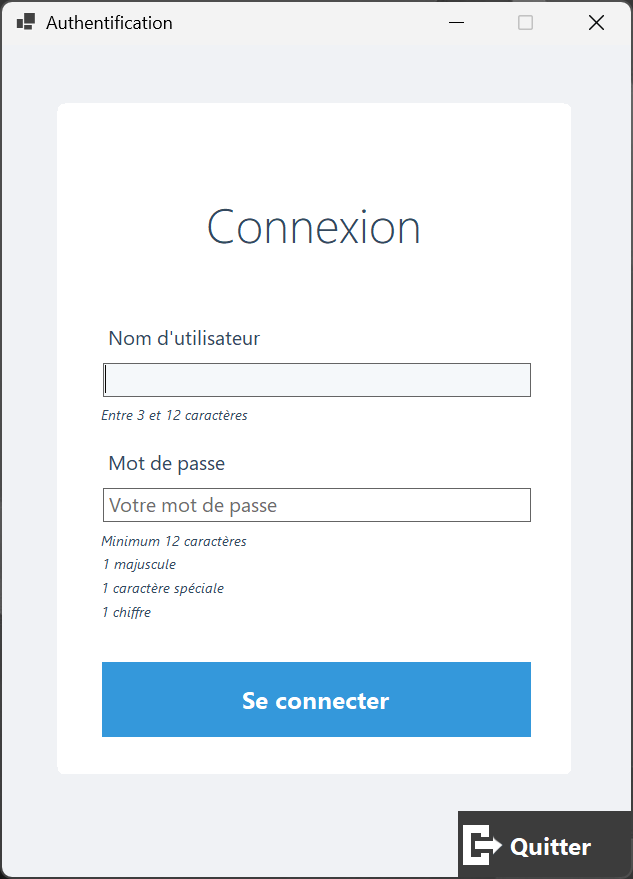
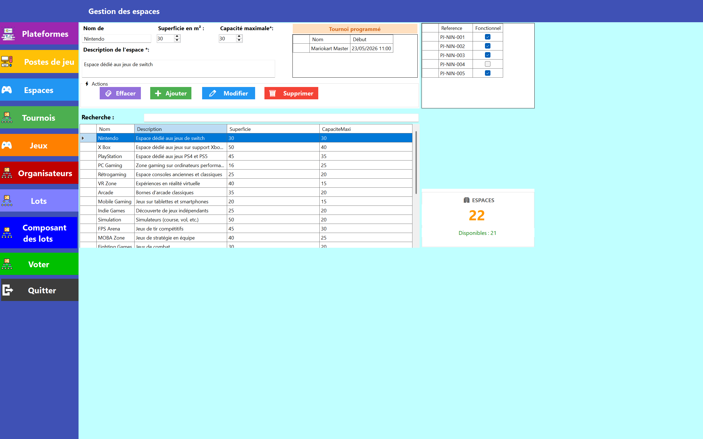
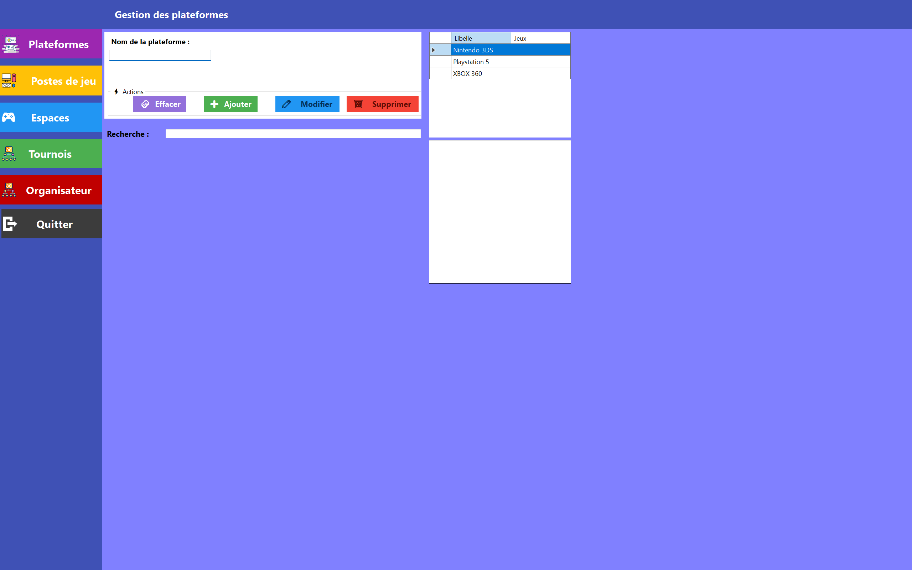
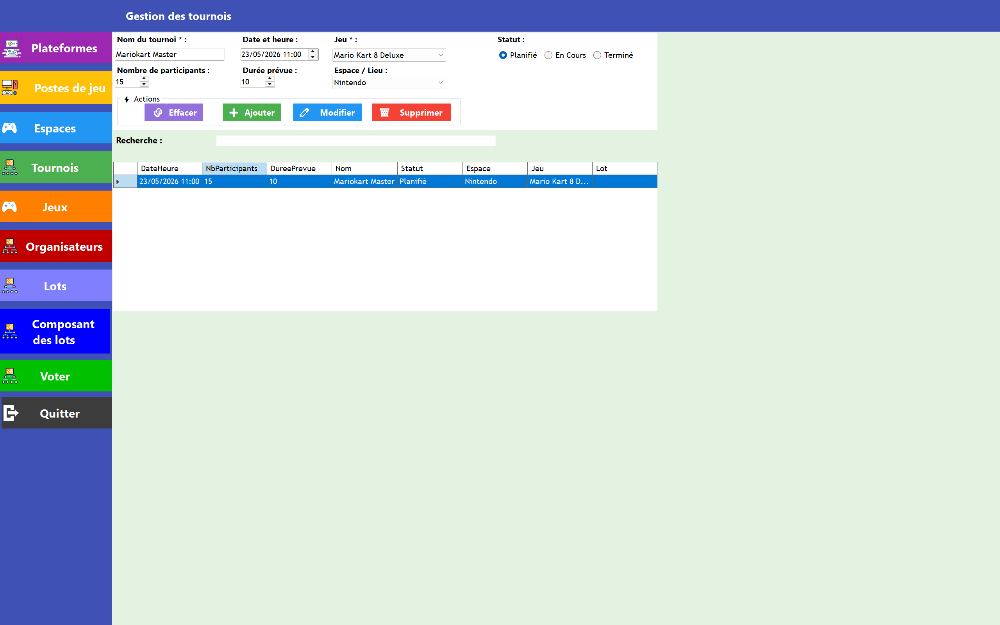
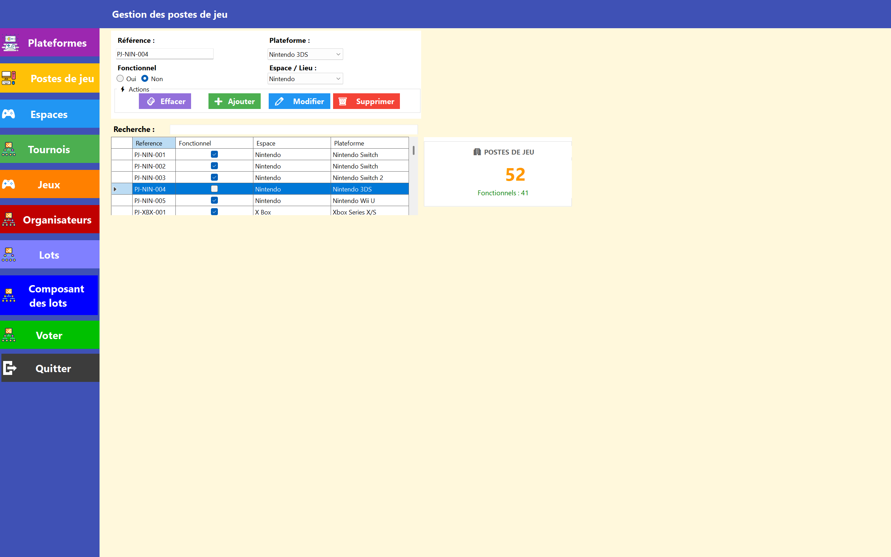
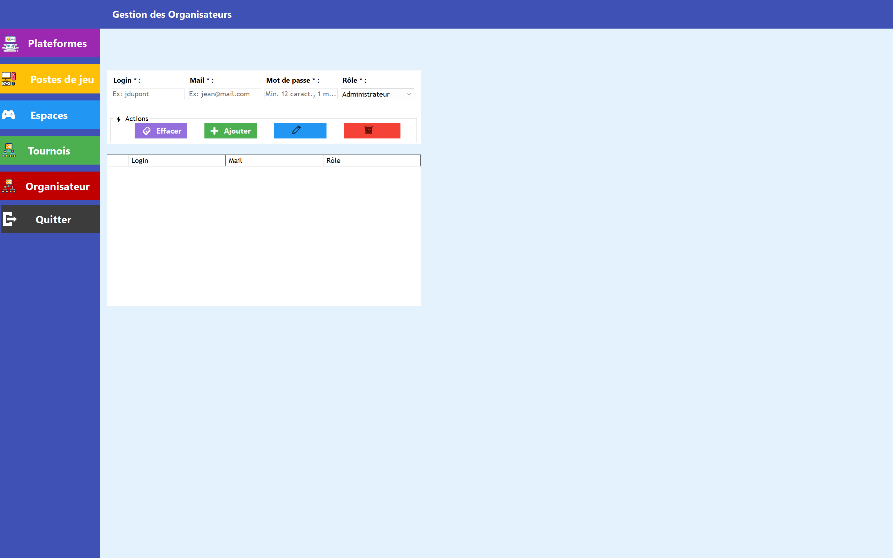
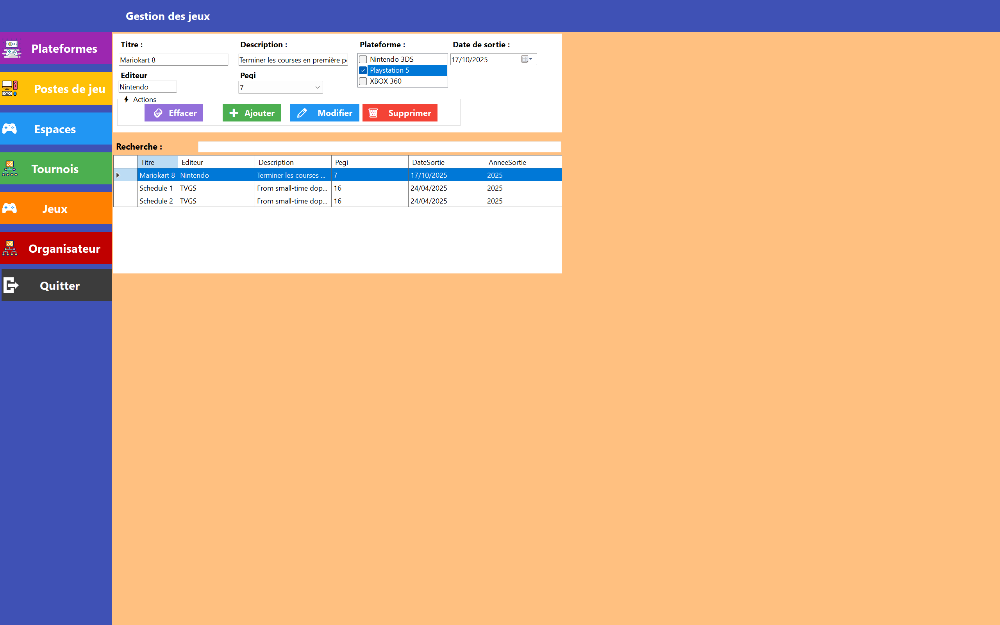
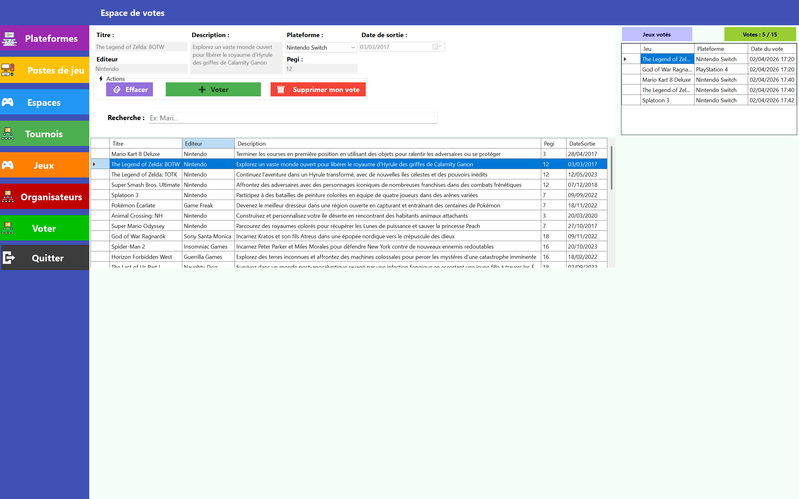

# Festival_Organisateur

Afin de lancer une nouvelle migration
Installer et mettre a jour dotnet sur la machine
dotnet tool update --global dotnet-ef

Puis:
dotnet ef migrations add InitialCreate --project Lib_Metier --startup-project ApplicationUi
dotnet ef database update --project Lib_Metier --startup-project ApplicationUi

## 📸 Captures d'écran

### Portail de connexion

### Acceuil

### Gestion des espaces

### Gestion des plateformes

### Gestion des tournois

### Gestion des postes de jeu

### Gestion des organisateurs

### Gestion des jeux

### Espace de votes pour les utilisateurs

