# 🎪 Festival Organisateur

Application de bureau **Windows Forms** développée en **C#** dans le cadre d'un BTS SIO Option SLAM (2024-2026).

Elle permet la gestion complète d'un festival : organisateurs, espaces, tournois, jeux, plateformes, lots et système de vote.

> ⚠️ Projet en cours de développement — versions alpha uniquement, ne pas déployer en production.
> 
> ℹ️ Renommage de SoumisVote en JeuSoumisVote pour une prise en main plus facile de l'application

---

## 📋 Sommaire

- [Contexte et objectifs](#contexte-et-objectifs)
  - [Objectifs principaux](#objectifs-principaux)
  - [Contraintes](#contraintes)
  - [Répartition-du-travail](#répartition-du-travail)
- [Fonctionnalités](#fonctionnalités)
  - [Gestion des plateformes](#gestion-des-plateformes)
  - [Gestion des espaces](#gestion-des-espaces)
  - [Gestion des postes de jeu](#gestion-des-postes-de-jeu)
  - [Gestion des jeux](#gestion-des-jeux)
  - [Gestion des tournois](#gestion-des-tournois)
  - [Gestion des participants](#gestion-des-participants)
  - [Gestion des jeux soumis au vote](#gestion-des-jeux-soumis-au-vote)
  - [👷 Gestion des organisateurs](#gestion-des-organisateurs)
  - [👷 Gestion des lots](#gestion-des-lots)
  - [👷 Gestion des composants des lots](#gestion-des-composants-des-lots)
  - [👷 Gestion des roles](#gestion-des-roles)
  - [👷 Gestion de l'authentification](#gestion-de-lauthentification)
- [Diagramme de flux](#diagramme-de-flux)
- [Choix techniques](#choix-techniques)
- [Architecture](#architecture)
  - [Relations entre les couches](#relations-entre-les-couches)
  - [Détail des couches](#détail-des-couches)
  - [Stack technique](#stack-technique)
  - [Packages NuGet](#packages-nuget)
  - [Conventions de nommage](#conventions-de-nommage-pour-le-code-métier)
    - [Git](#git)
- [Sécurité](#sécurité)
- [Gestion des rôles](#gestion-des-rôles)
- [Modèle de données](#modèle-de-données)
  - [Schémas de la base de données](#schémas-de-la-base-de-données)
- [Logs](#logs)
- [Tests unitaires](#tests-unitaires)
- [Documentation des validations métier](#documentation-des-validations-métier)
  - [Architecture des contrôles](#architecture-de-mise-en-place-du-controles-des-données)
  - [UserControl Tournois](#démarche-à-suivre-dans-le-usercontrol-dédié-aux-tournois-configuration-minimale)
  - [Interface & Service](#faire-le-lien-entre-linterface-et-le-service)
  - [Exceptions métier](#création-des-exceptions)
  - [Liste des contrôles](#listes-des-controles-présents-actuellement)
    - [Espace](#espace)
    - [Jeu](#jeu)
    - [Plateforme](#plateforme)
    - [Poste de jeu](#poste-de-jeu)
    - [Tournoi](#tournoi)
    - [JeuSoumisVote](#jeusoumisvote)
    - [Participer](#participer-inscription-à-un-tournoi)
    - [Vote](#vote-voter)
- [Limites et axes d'amélioration](#limites-et-axes-damélioration)
  - [Limites actuelles](#limites-actuelles)
  - [Améliorations possibles](#améliorations-possibles)
- [Prérequis](#️-prérequis)
- [Installation & Migrations](#-installation--migrations)
  - [Cloner le dépôt](#1-cloner-le-dépôt)
  - [Installer EF CLI](#2-installer-loutil-ef-core-cli)
  - [Appliquer les migrations](#3-appliquer-les-migrations)
  - [Mettre à jour la base](#4-mettre-à-jour-une-migration)
  - [Lancer l'application](#5-lancer-lapplication)
  - [Réinitialiser la base](#réinitialiser-la-base-de-données-développement-uniquement)
- [Contributeurs](#-contributeurs)
- [Releases](#-releases)
- [Captures d'écran](#-captures-décran)

---

## Contexte et objectifs

[Retourner au sommaire](#-sommaire)

Ce projet a été réalisé dans le cadre du BTS SIO SLAM afin de répondre à un besoin de gestion complète d'un festival.

### Objectifs principaux

- Centraliser la gestion des tournois et des espaces
- Assurer la cohérence des données via des validations métier
- Mettre en place une architecture maintenable et évolutive
- Implémenter une gestion des rôles et des permissions
- Garantir la robustesse de l'application via la gestion des exceptions

### Contraintes

- Application desktop (WinForms imposé)
- Utilisation de C# et Entity Framework Core
- Base de données locale (SQLite)

### Répartition du travail

[@lucienlaf](https://github.com/lucienlaf) : _Collaborateur_

> - Gestion des Lots
> - Gestion des Lots composants
> - Gestion de l'authentification
> - Gestion des Organisateurs
> - Gestion des Roles

---

[@benjaminlrl](https://github.com/benjaminlrl) : _Responsable du repository git_

> - Évolution des Espaces
> - Évolution des Postes de jeu
> - Évolution des Tournois
> - Gestion des Plateformes
> - Gestion des Jeux
> - Gestion des Votes
> - Gestion des jeux soumis aux votes (JeuSoumisVote)
> - Gestion des Participants

---

## Fonctionnalités

[Retourner au sommaire](#-sommaire)

### 👤 Organisateurs

- Authentification avec hashage du mot de passe (BCrypt)
- Création et gestion des comptes organisateurs
- Gestion des rôles et permissions par module (Administrateur, Gestionnaire du stock, Gestionnaire de l'espace, Gestionnaire des tournois)

---

### Gestion des plateformes

-	Création et gestion des plateformes associés aux postes de jeu et aux jeux;
-	Affichage des postes de jeux et des jeux associés à la plateforme lors du chargement de celle-ci dans le formulaire.
-	En double cliquant sur un jeu lié à la plateforme, l’utilisateur est redirigé vers la gestion des jeux, avec le jeu cliqué préchargé pour faciliter la navigation dans l’application.
-	En double cliquant sur un poste de jeu lié à la plateforme, l’utilisateur est redirigé vers la gestion des postes de jeu, avec le poste de jeu cliqué préchargé pour faciliter la navigation dans l’application.
-	Possibilité de filtrer les résultat via la barre de recherche.
-	Pour charger une plateforme dans le formulaire il suffit de cliquer sur celui souhaité dans la dataGridView (tableau d’affichage de toutes les plateformes).
-	L’utilisateur peut trier l’ordre d’affichage sur une colonne en cliquant sur le nom de celle-ci.
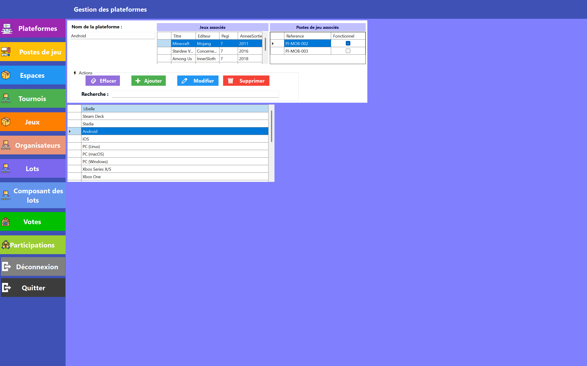

---

### Gestion des espaces

-	Création et gestion des espaces du festival (nom, description, superficie, capacité max).
-	Statut des espaces associés à des tournois.
-	Affichage du nombres de postes fonctionnels
-	En double cliquant sur les postes de jeux associés à l’espace, cela redirige l’utilisateur vers la gestion des postes de jeu, avec le poste de jeu cliqué préchargé pour faciliter la navigation dans l’application.
-	En double cliquant sur les tournois liés à l’espace, redirection vers la gestion des tournois, avec le tournoi cliqué préchargé pour faciliter la navigation dans l’application.
-	Possibilité de filtrer les résultat via la barre de recherche.
-	Pour charger un espace dans le formulaire il suffit de cliquer sur celui souhaité dans la dataGridView (tableau d’affichage de tous les espaces).
-	L’utilisateur peut trier l’ordre d’affichage sur une colonne en cliquant sur le nom de celle.
  
> Contrôle sur le nom de l’espace, pour l’instant, le formatage des postes de jeux repose sur le nom de l’espace, en particulier sur ses trois premières lettres. Si celles-ci correspondent à un autre espace lors de l’ajout ou de la modification du nom de celui-ci.
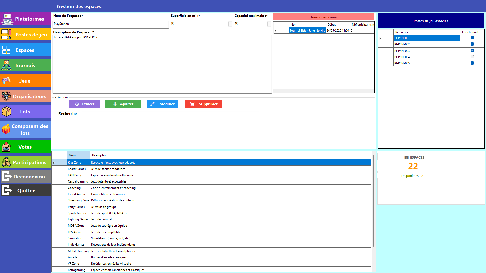

---

### Gestion des postes de jeu

-	Création et gestion des jeux du festival (Référence, État fonctionnel, plateforme, espace).
-	Affichage des tournois en cours ou à venir associés à l'espace. Cela permet de savioir si le poste de jeu est actuelelemnt occupé
-	En double cliquant sur un tournoi lié à l'espace du poste de jeu, l’utilisateur est redirigé vers la gestion des tornois, avec le tournoi cliqué préchargé pour faciliter la navigation dans l’application.
-	En double cliquant sur l'espace du poste de jeu dans la dataGridView, l’utilisateur est redirigé vers la gestion des espaces, avec l'espace cliqué préchargé pour faciliter la navigation dans l’application.
-	Indication du nobres de postes de jeu fonctionnels.
-	Pour charger un poste de jeu dans le formulaire il suffit de cliquer sur celui souhaité dans la dataGridView (tableau d’affichage de tou sles postes de jeu).
-	L’utilisateur peut trier l’ordre d’affichage sur une colonne en cliquant sur le nom de celle.
  
> La référence du poste de jeu est formater automatiquement garantissement un meilleur suivi des postes de jeu. Elle n'est pas modifiable par l'organisateur. Ainsi un poste de jeu aura toujours la même plateforme et le même espace.

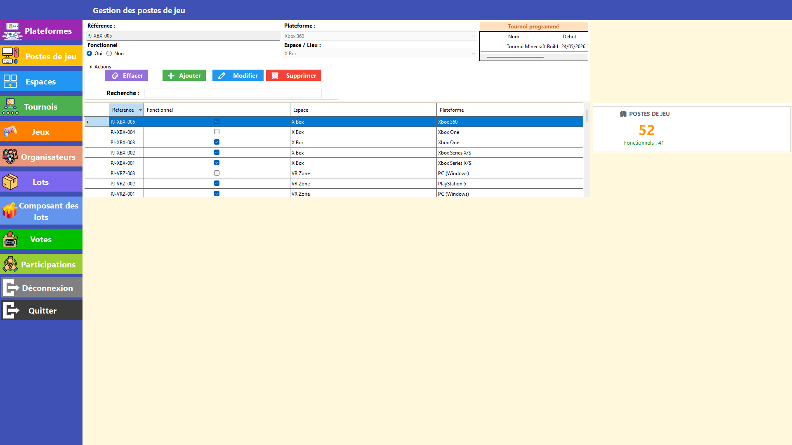

---

### Gestion des jeux

-	Création et gestion des jeux du festival (titre, éditeur, année de sortie, PEGI, description, plateformes).
-	Possibilité de filtrer les résultat via la barre de recherche.
-	Pour charger un jeu vote dans le formulaire il suffit de cliquer sur celui souhaité dans la dataGridView (tableau d’affichage de tous les jeux).
-	L’utilisateur peut trier l’ordre d’affichage sur une colonne en cliquant sur le nom de celle-ci.

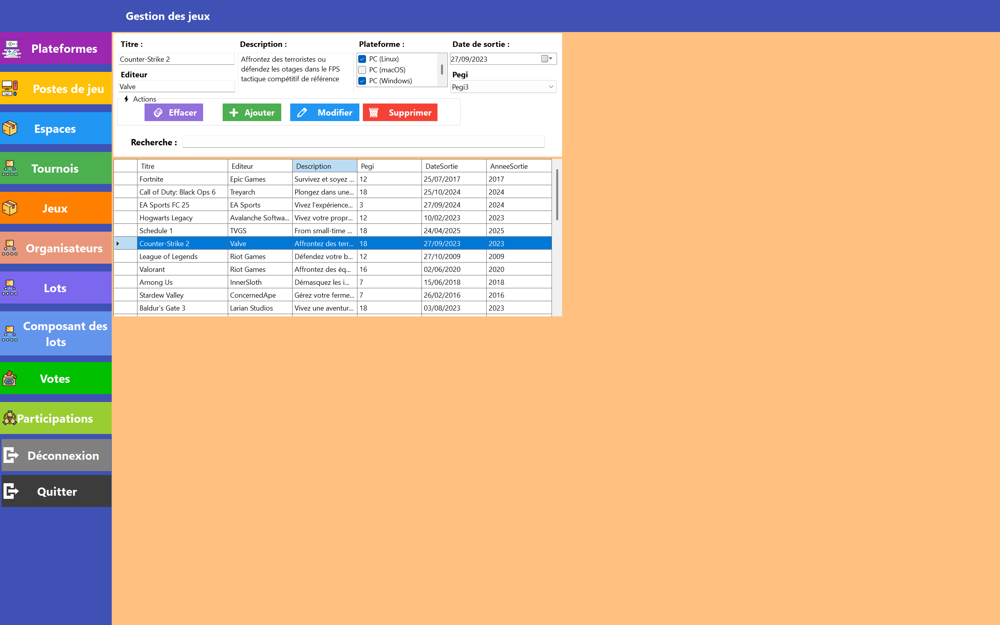

---

### Gestion des tournois

-	Création et gestion des tournois du festival (nom, description, date et heure, durée prévue, jeu, espace, statut, nombre de participants max, nombre de participants inscrit).
-	Affichage du nombres d'inscrit au tournois
-	En double cliquant sur le jeu associé au tournoi dans la dataGridView, cela redirige l’utilisateur vers la gestion des jeux, avec le jeu cliqué préchargé pour faciliter la navigation dans l’application.
-	En double cliquant sur l'espace associé au tournoi dans la dataGridView, cela redirige l’utilisateur vers la gestion des espaces, avec l'espace cliqué préchargé pour faciliter la navigation dans l’application.
-	Possibilité de filtrer les résultat via la barre de recherche.
-	Pour charger un espace dans le formulaire il suffit de cliquer sur celui souhaité dans la dataGridView (tableau d’affichage de tous les espaces).
-	L’utilisateur peut trier l’ordre d’affichage sur une colonne en cliquant sur le nom de celle.

> Le statut du tournoi est géré automatiquement par le code métier, en conséquent l'organisateur ne peut pas le modifier

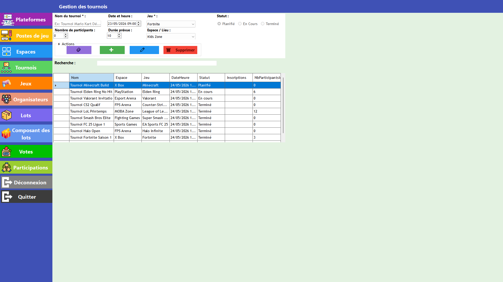

---

### Gestion des participants

-	Création et gestion des participations des utilisateurs aux tournois proposés durant le festival :
  -	Affichage de la participation, (id du tournoi associé à l’id de l’utilisateur) ;
  -	Saisie du rang et du score final par l’organisateur une fois le tournoi terminé ;
  -	Indication si un lot a été remis à l’utilisateur ;
  -	Affichage de l’évaluation et du commentaire du participants une fois le tournoi terminé.
-	Affichage des autres participations de l’utilisateur.
-	En double cliquant sur un tournoi lié à une participation, l’utilisateur  est redirigé vers la gestion des tournois, avec le tournoi cliqué préchargé pour faciliter la navigation dans l’application.
-	Possibilité de filtrer les résultat via la barre de recherche.
-	Pour charger une participation dans le formulaire il suffit de cliquer sur celui souhaité dans la dataGridView (tableau d’affichage de toutes participations).
-	L’utilisateur peut trier l’ordre d’affichage sur une colonne en cliquant sur le nom de celle.

> Une évaluation est par défaut à 0, si le participant décide de laisser une évaluation à la fin du tournoi, celle-ci doit au moins valoir 1 pour la considérer comme modifier par le participant.
> De même pour le commentaire par défaut, une chaîne de charactère vide "".

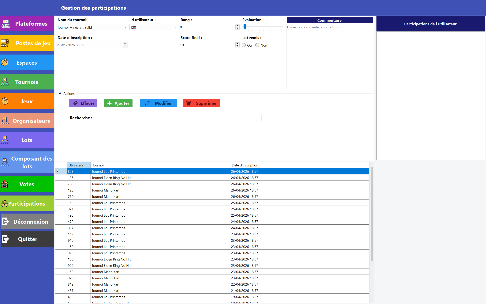

---

### Gestion des jeux soumis au vote

-	Création et gestion des jeux du festival (jeu, plateforme, date de début, date de fin).
-	Possibilité de filtrer les résultat via la barre de recherche.
-	Pour charger un jeu/plateforme soumis aux vote dans le formulaire il suffit de cliquer sur celui souhaité dans la dataGridView (tableau d’affichage de tous les binomes soumis aux votes).
-	L’utilisateur peut trier l’ordre d’affichage sur une colonne en cliquant sur le nom de celle-ci.


---

### Gestion des lots

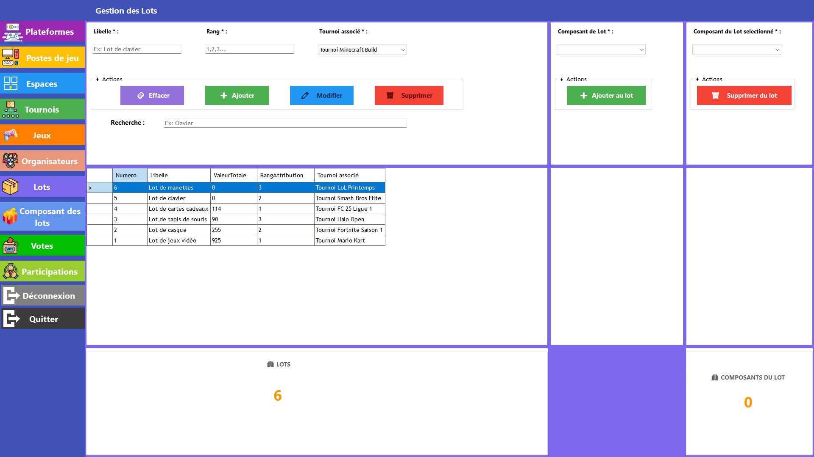

---

### Gestion des composants des lots

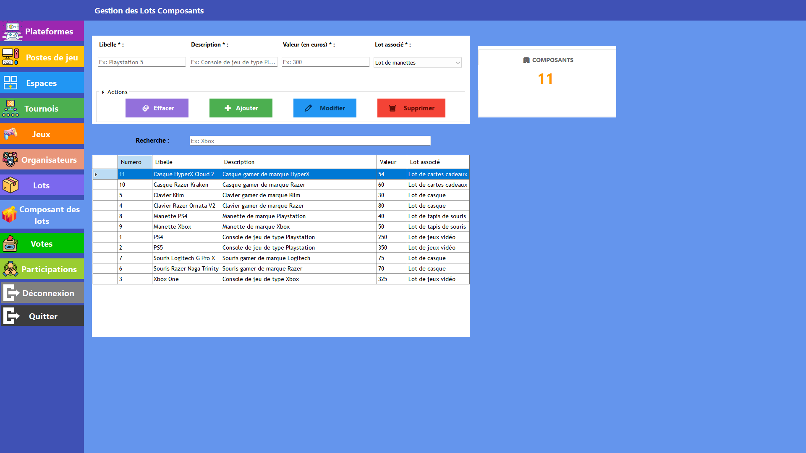

---

### Gestion des organisateurs

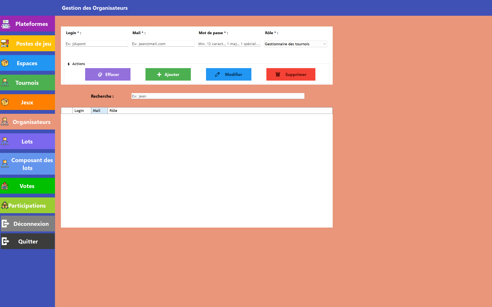


---

## Diagramme de flux

[Retourner au sommaire](#-sommaire)

```
[Utilisateur]
     │
     ▼
[IHM — UserControl]          ← Contrôles de surface (champs requis, formats)
     │
     ▼
[Service métier]             ← Validation métier approfondie + exceptions typées
     │
     ▼
[Entity Framework Core]      ← Accès base de données via ApplicationDbContext
     │
     ▼
[SQLite]
     │
     ▼
[Retour IHM]                 ← Succès (MessageBox) ou erreur (TournoiException, DbException…)
```

---

## Choix techniques

[Retourner au sommaire](#-sommaire)

### Architecture en couches

Le choix d'une architecture en couches permet :

- Une séparation claire des responsabilités
- Une meilleure testabilité
- Une maintenabilité accrue

### Utilisation d'Entity Framework Core

- Simplifie l'accès aux données
- Permet la gestion des migrations
- Réduit le code SQL manuel

### Gestion des exceptions métier

Les validations sont centralisées dans les services afin de :

- Éviter la duplication de code
- Garantir l'intégrité des données
- Faciliter les tests unitaires

---

## Architecture

[Retourner au sommaire](#-sommaire)

_CRUD signifie Create, Read, Update, Delete_  
_CUD signifie Create, Update, Delete_  
_R signifie Read_

Le projet suit une **architecture en couches** afin de séparer clairement les responsabilités et faciliter la maintenance.

```
Festival_Organisateur/
├── ApplicationUi/              # Interface utilisateur (WinForms)
├── Lib_Entities/               # Entités métier (POCO)
├── Lib_Metier/                 # DbContext EF Core, configurations, migrations
├── Lib_Services/               # Logique métier, interfaces, validations, exceptions
└── Documentation/              # Captures d'écran & documents
```

### Relations entre les couches

```
ApplicationUI → Lib_Services → Lib_Entities
               Lib_Metier   → Lib_Entities
```

### Détail des couches

**`Lib_Entities`** — Entités métier  
Contient uniquement les classes métier, chacune correspondant à une table de la base de données.

**`Lib_Metier`** — Accès aux données (EF Core)  
Contient le `DbContext`, les classes de configuration EF Core (`XxxConf.cs`) définissant les clés primaires, relations et contraintes, ainsi que le dossier `Migrations`.

**`Lib_Services`** — Logique métier  
Contient les interfaces (`IxxxService`) et leurs implémentations. Centralise les règles métier, les exceptions et les accès EF Core.

**`ApplicationUI`** — Interface utilisateur  
Contient la `FormMain`, les `UserControls` (`UcXxx`) par module et la gestion des droits d'accès.

### Stack technique

| Technologie           | Usage                     |
| --------------------- | ------------------------- |
| C# / WinForms         | Interface utilisateur     |
| Entity Framework Core | ORM                       |
| SQLite                | Base de données           |
| BCrypt                | Hashage des mots de passe |
| Serilog               | Journalisation            |

### Packages NuGet

- `Microsoft.EntityFrameworkCore`
- `Microsoft.EntityFrameworkCore.Sqlite`
- `Microsoft.EntityFrameworkCore.Tools`
- `Microsoft.EntityFrameworkCore.Design`
- `BCrypt.Net-Next`
- `Serilog`
- `Serilog.Sinks.File`

### Conventions de nommage pour le code métier

- Les classes sont écrites en PascalCase (ex: `FestivalOrganisateur`).
- Les méthodes sont écrites en PascalCase (ex: `OrganiserFestival()`).
- Les variables locales sont écrites en camelCase (ex: `nomFestival`).
- Les constantes sont écrites en majuscules avec des underscores (ex: `NOMBRE_MAX_FESTIVALS`).
- Les fichiers sont nommés en fonction de la classe qu'ils contiennent (ex: `FestivalOrganisateur.cs`).
- Les namespaces suivent la convention PascalCase (ex: `Festival.Organisateur.Services`).
- Les interfaces sont nommées en PascalCase et commencent par `I` (ex: `ITournoiService`).
- Les exceptions sont nommées en PascalCase et se terminent par `Exception` (ex: `TournoiException`).
- Les UserControls sont nommés en PascalCase et préfixés par `Uc` (ex: `UcTournois`).
- Les fichiers de configuration EF Core sont nommés en PascalCase et suffixés par `Conf` (ex: `TournoiConf.cs`).
- Les tests unitaires sont nommés en fonction de la classe testée, suffixés par `Tests` (ex: `TournoiServiceValidationTests`).
- Les commentaires sont écrits en français et expliquent clairement le but de chaque classe, méthode et variable.
- Les noms de variables et de méthodes doivent être descriptifs et refléter leur fonction.

### Git

#### Conventions de nommage pour les branches

```
feature/auth
feature/user-profile
fix/login-bug
hotfix/security-patch
```

#### Conventions de nommage pour les commits

```
type(scope): message
```

##### Types principaux

| Type       | Usage                                    |
| ---------- | ---------------------------------------- |
| `feat`     | Nouvelle fonctionnalité                  |
| `fix`      | Correction de bug                        |
| `refactor` | Amélioration sans changement fonctionnel |
| `docs`     | Documentation                            |
| `test`     | Tests                                    |
| `chore`    | Maintenance                              |

##### Exemples

```
feat(auth): ajout d'un role d'organisateur
fix(auth): controle approfondi sur le Role "Gestionnaire de stock"
refactor(auth): simplification de la méthode ActionMethode()
```

---

## Sécurité

[Retourner au sommaire](#-sommaire)

- Hashage des mots de passe avec BCrypt
- Validation stricte des données côté service
- Gestion des erreurs via exceptions métier
- Limitation des actions via rôles

---

## Gestion des rôles

[Retourner au sommaire](#-sommaire)

Quatre rôles ont été définis dans l'application :

| Rôle                          | CRUD                                | Consultation                                  |
| ----------------------------- | ----------------------------------- | --------------------------------------------- |
| **Administrateur**            | Toutes les tables                   | —                                             |
| **Gestionnaire du stock**     | Lot, LotComposant                   | Tournoi, Jeu, Espace, PosteJeu, Plateforme    |
| **Gestionnaire de l'espace**  | Espace, PosteJeu, Tournoi           | Plateforme, Jeu, Participer                   |
| **Gestionnaire des tournois** | Tournoi, Participer, JeuSoumisVote | Espace, PosteJeu, Plateforme, Jeu, Lot, Voter |

---

## Modèle de données

[Retourner au sommaire](#-sommaire)

### Schémas de la base de données

> **Comprendre :** Les entités principales sont : `Organisateur`, `Role`, `Joueur`, `Jeu`, `Plateforme`, `Tournoi`, `Espace`, `Poste_Jeu`, `Lot`, `LotComposant`, `JeuSoumisVote`, `Voter`, `Participer`.

La connexion à la base de données est gérée via `ApplicationDbContext`, instancié directement dans chaque service :

```csharp
_context = new ApplicationDbContext();
```

Aucun fichier de configuration externe n'est requis — la base SQLite est créée localement au premier lancement après application des migrations.

#### Schéma UML

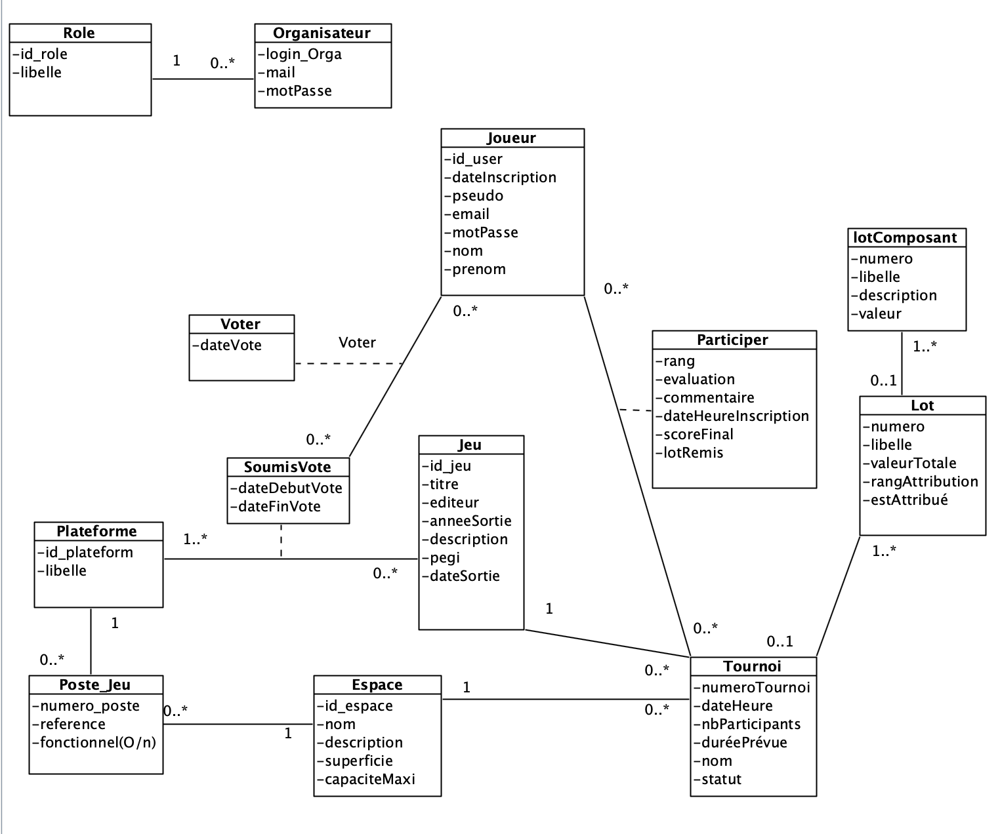

#### Schéma relationnel de la base de données actuelle

> **Note sur la table `JeuPlateforme`**  
> Cette table n'est pas modélisée explicitement dans le code. Il s'agit d'une table de jointure générée automatiquement par EF Core pour gérer la relation many-to-many entre `Jeu` et `Plateforme` via les propriétés de navigation (`ICollection<Plateforme>`). EF Core la gère en coulisse via `.Include()` — elle existe en base de données mais ne figure pas dans les modèles du projet.  
> [Docuementation microsoft dédiée aux relations many-to-many](https://learn.microsoft.com/en-us/ef/core/modeling/relationships/many-to-many)

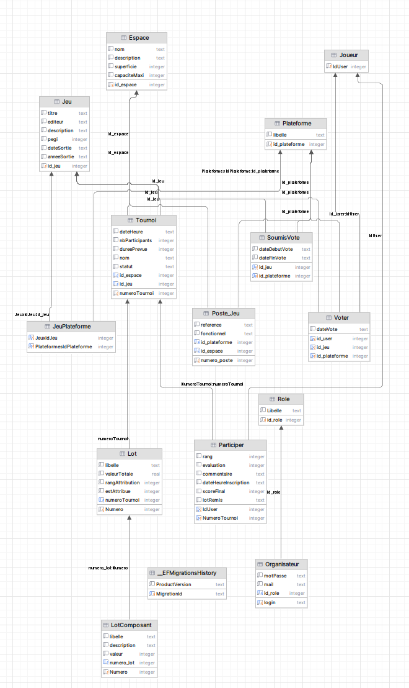

#### Schéma relationnel de la base de données prévu

> **Pourquoi "prévu" ?** Durant l'évolution de l'application, la fonction EF Core `.ThenInclude()` a permis de supprimer certaines tables intermédiaires initialement prévues, en gérant les relations de navigation directement via l'ORM.

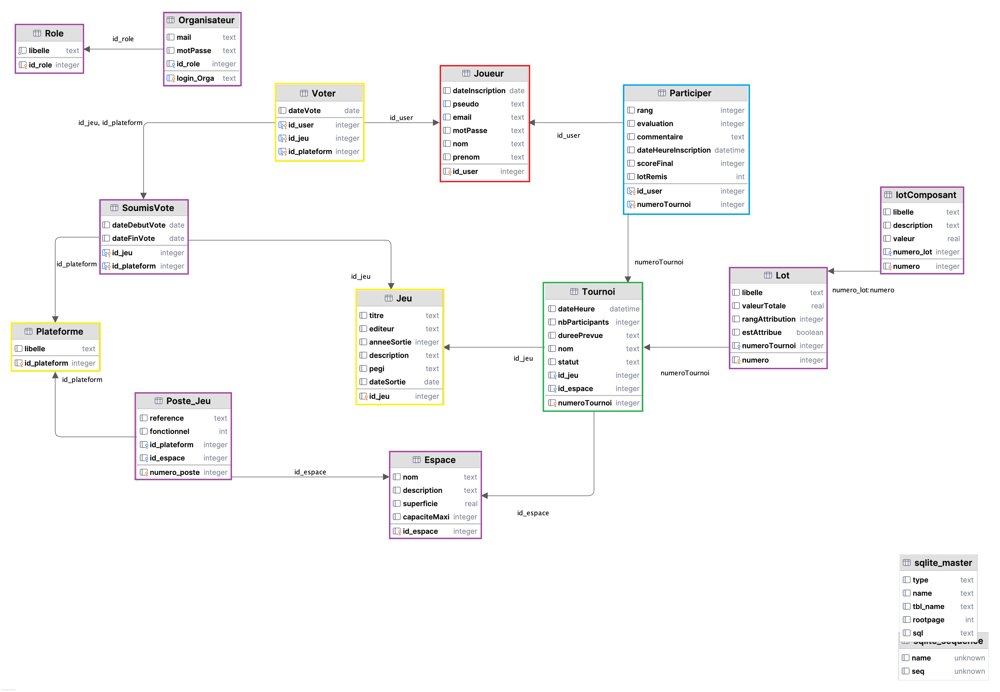

---

## Logs

[Retourner au sommaire](#-sommaire)

L'application utilise **Serilog** pour journaliser les événements applicatifs. Les logs sont écrits dans un fichier situé à :

```
ApplicationUi\bin\Debug\net10.0-windows\logs\
```

Trois niveaux sont utilisés dans le code :

| Niveau        | Usage                                             |
| ------------- | ------------------------------------------------- |
| `Log.Warning` | Erreurs métier attendues (ex: validation échouée) |
| `Log.Error`   | Erreurs techniques ou inattendues                 |

Exemple dans un UserControl :

```csharp
catch (TournoiException ex)
{
    Log.Warning("[{Code}] {Message}", ex.CodeErreur, ex.Message);
}
catch (Exception ex)
{
    Log.Error(ex, "Une erreur inattendue est survenue.");
}
```

---

## Tests unitaires

[Retourner au sommaire](#-sommaire)

Les tests unitaires couvrent les validations métier des services. Ils sont indépendants de l'interface utilisateur et s'appuient directement sur les services.

```
Festival_Organisateur/
└── ServiceTests/
    └── TournoiServiceValidationTests.cs
```

Pour lancer les tests depuis Visual Studio : `Ctrl + R, A` ou via le menu **Test → Exécuter tous les tests**.

> Les tests utilisent un contexte en mémoire ou une base SQLite de test — aucune base de production n'est affectée.

---

## Documentation des validations métier

[Retourner au sommaire](#-sommaire)

### Architecture de mise en place du controles des données

```
Festival_Organisateur/
├── Application_Ui/TournoiUc.cs                          # Contrôles sur les interactions et données entre l'IHM et TournoiService.cs
├── Lib_Services/ITournoiService.cs                       # Interface qui permet de ne pas avoir à réécrire les Uc en cas de migrations techniques
├── Lib_Services/TournoiService.cs                        # Contrôles sur les données liés aux tournois avant interaction en base
└── ServiceTests/TournoiServiceValidationTests.cs         # Tests unitaires dédiés aux tournois
```

### Démarche à suivre dans le UserControl dédié aux Tournois (configuration minimale)

_Faire le lien entre le UserControl et l'Interface_

```
Festival_Organisateur/
└── Application_Ui/TournoiUc.cs
```

```csharp
using Lib_Entities.Entities;
using Lib_Metier.Data.Configurations;
using Lib_Services.Exceptions;
using Lib_Services.Interfaces;
using Lib_Services.Services;

namespace ApplicationUi
{
    public partial class UcTournois : UserControl
    {
        private readonly ApplicationDbContext _context;
        private readonly ITournoiService _serviceTournoi;

        public UcTournois()
        {
            InitializeComponent();
            _context = new ApplicationDbContext();
            _serviceTournoi = new TournoiService(_context);
[...]
```

_Ajouter un Tournoi dans la base de données_

```csharp
private void ButtonAjouter_Click(object sender, EventArgs e)
{
    Tournoi tournoi = new ()
    {
        Nom = textBoxNom.Text,
        DateHeure = dateTimePickerDateTournoi.Value,
        NbParticipants = (int)numericUpDownNbParticip.Value,
        DureePrevue = (int)numericUpDownDuree.Value,
        Statut = statutSelectionne,
        IdEspace = (comboBoxEspace.SelectedItem as Espace).IdEspace,
        IdJeu = (comboBoxJeu.SelectedItem as Jeu).IdJeu,
    };

    try
    {
        _serviceTournoi.Creer(tournoi);
        MessageBox.Show("Le tournoi a bien été ajouté.", "Ajout", MessageBoxButtons.OK, MessageBoxIcon.Information);
        Raz_Zones();
    }
    catch (TournoiException ex)
    {
        Log.Warning("[{Code}] {Message}", ex.CodeErreur, ex.Message);
        MessageBox.Show("Veuillez vérifier les informations saisies.\n" + ex.Message, "Ajout", MessageBoxButtons.OK, MessageBoxIcon.Warning);
    }
    catch (DbException ex)
    {
        Log.Error(ex, "Une erreur technique est survenue lors de l'ajout du tournoi.");
        MessageBox.Show("Erreur technique, réessayez plus tard.");
    }
    catch (Exception ex)
    {
        Log.Error(ex, "Une erreur inattendue est survenue.");
        MessageBox.Show("Une erreur inattendue est survenue.");
    }
}
```

### Faire le lien entre l'Interface et le Service

> Info : La méthode n'est pas accessible dans le Uc si sa signature n'est pas définie dans l'Interface et si sa signature existe dans le service.

```
Festival_Organisateur/
└── Lib_Services/Interfaces/ITournoiService.cs
```

```csharp
using Lib_Entities.Entities;

namespace Lib_Services.Interfaces
{
    public interface ITournoiService
    {
        #region CUD
        /// <summary>
        /// Crée un nouveau tournoi en base après validation métier minimale.
        /// Lance une <see cref="ArgumentException"/> si le nombre de participants est invalide.
        /// </summary>
        /// <param name="tournoi">Instance du tournoi à créer.</param>
        void Creer(Tournoi tournoi);
[...]
```

```
Festival_Organisateur/
└── Lib_Services/Services/TournoiService.cs
```

```csharp
using Lib_Entities.Entities;
using Lib_Metier.Data.Configurations;
using Lib_Services.Exceptions;
using Lib_Services.Interfaces;
using Microsoft.EntityFrameworkCore;

namespace Lib_Services.Services
{
    /// <summary>
    /// Service métier responsable des opérations
    /// CRUD sur l'entité <see cref="Tournoi"/>.
    /// </summary>
    public class TournoiService : ITournoiService
    {
        private readonly ApplicationDbContext _context;

        /// <summary>
        /// Initialise une nouvelle instance de <see cref="TournoiService"/>.
        /// </summary>
        /// <param name="context">DbContext injecté pour l'accès aux données.</param>
        public TournoiService(ApplicationDbContext context)
        {
            _context = context;
        }

[...]

#region CUD
        /// <summary>
        /// Crée un nouveau tournoi en base après validation métier minimale.
        /// Lance une <see cref="ArgumentException"/> si le nombre de participants est invalide.
        /// </summary>
        /// <param name="tournoi">Instance du tournoi à créer.</param>
        public void Creer(Tournoi tournoi)
        {
            ValiderTournoi(tournoi, false);
            _context.Tournois.Add(tournoi);
            _context.SaveChanges();
        }
```

---

### Création des Exceptions

> Info : on contrôle chaque action de l'utilisateur (politique du moindre privilège). Pour contrôler ses actions, nous utilisons les exceptions.

#### Avantages

- Indépendant des Uc
- Contrôles profonds des données
- Meilleure maintenabilité
- Exceptions personnalisées
- Facile à utiliser pour les tests unitaires

#### Inconvénients

- Lourd à mettre en place

#### Mise en place

```
Festival_Organisateur/
└── Lib_Services/Services/TournoiService.cs
```

```csharp
/// <summary>
/// Permet de valider les données d'un tournoi avant création ou modification.
/// </summary>
/// <param name="tournoi">Tournoi à valider</param>
/// <param name="estModification">Indique si c'est une modification ou une création</param>
/// <exception cref="TournoiException">Exception si les données du tournoi sont invalides</exception>
public void ValiderTournoi(Tournoi tournoi, bool estModification = false)
{
    if (string.IsNullOrWhiteSpace(tournoi.Nom))
        throw new TournoiException("Le nom est requis.",
            (int)TournoiException.TournoiErreur.TournoiNomRequis);

    if (estModification)
    {
        Tournoi? enBdd = Obtenir(tournoi.NumeroTournoi);

        if(enBdd == null)
            throw new TournoiException("Tournoi inexistant en base de donnée.",
                (int)TournoiException.TournoiErreur.ModificationTournoiInexistant);
    [...]
```

`TournoiNomRequis` correspond au nom associé au code de l'Exception.  
`TournoiException` correspond à la classe dédiée aux exceptions liées aux tournois.  
`TournoiErreur` correspond à la propriété de la classe `TournoiException` qui contient les codes.

#### Définir les codes des exceptions

```
Festival_Organisateur/
└── Lib_Services/Exceptions/TournoiException.cs
```

```csharp
namespace Lib_Services.Exceptions
{
    public class TournoiException : Exception
    {
        public int CodeErreur { get; }

        public enum TournoiErreur
        {
            TournoiNomRequis = 1,
            ModificationTournoiInexistant = 2,
            // LeNomDeException = ...,
        }

        public TournoiException(string message, int codeErreur) : base(message)
        {
            CodeErreur = codeErreur;
        }
    }
}
```

---

### Listes des controles avec les Exceptions présentes actuellement

#### Espace

##### Création et modification

- Le nom est requis
- Le nom doit être unique (pas déjà attribué à un autre espace)
- Les 3 premières lettres du nom doivent être uniques (utilisées pour le formatage des références des postes de jeu) — ignoré si `modifPosteJeu = true`
- La description est requise
- La superficie doit être comprise entre 9 et 60
- La capacité maximale doit être comprise entre 0 et 50

##### Modification uniquement

- L'espace doit exister en base
- L'identifiant ne peut pas être modifié
- Au moins une modification doit être détectée
- Si le nom est modifié sans `modifPosteJeu = true`, une confirmation est requise (les postes de jeu associés seraient désynchronisés)

---

#### Jeu

##### Création et modification

- Le titre est requis
- Le titre doit être unique
- La description est requise et ne doit pas dépasser 500 caractères
- L'éditeur est requis
- La date de sortie est requise
- Le PEGI doit correspondre à une valeur valide de l'énumération

---

#### Plateforme

##### Création et modification

- Le libellé est requis
- Le libellé doit être unique
- L'identifiant doit être positif ou nul

##### Modification uniquement

- La plateforme doit exister en base
- Au moins une modification doit être détectée

##### Suppression

- La plateforme ne doit pas avoir de postes de jeu associés
- La plateforme ne doit pas avoir de jeux associés

---

#### Poste de jeu

##### Création et modification

- La référence est requise
- Un espace doit être associé (`IdEspace > 0`)
- Une plateforme doit être associée (`IdPlateforme > 0`)
- La référence doit être unique parmi les postes de jeu existants

##### Création uniquement

- La référence est générée automatiquement à partir des 3 premières lettres de l'espace et d'un numéro séquentiel
- Si la référence générée existe déjà, le numéro est incrémenté jusqu'à trouver une référence disponible

##### Modification uniquement

- Le poste de jeu doit exister en base
- Au moins une modification doit être détectée
- L'espace associé ne peut pas être modifié
- La plateforme associée ne peut pas être modifiée

---

#### Tournoi

##### Création et modification

- Le nom est requis
- Le nom doit être unique
- Un jeu doit être associé (`IdJeu > 0`)
- Un espace doit être associé (`IdEspace > 0`)
- Le nombre de participants doit être supérieur à 0
- La durée prévue doit être supérieure à 0
- Le statut est requis
- Pas de conflit horaire avec un autre tournoi dans le même espace (chevauchement ou doublon "En cours")
- Les horaires doivent respecter les plages autorisées : Samedi 10h–20h, Dimanche 10h–18h

##### Création uniquement

- La date et l'heure doivent être dans le futur

##### Modification uniquement

- Le tournoi doit exister en base
- Au moins une modification doit être détectée
- Le jeu associé ne peut pas être modifié
- Le statut d'un tournoi "Terminé" ne peut pas être changé

---

#### JeuSoumisVote

##### Création et modification

- Le jeu associé doit exister en base
- La plateforme associée doit exister en base
- La date de début doit être antérieure à la date de fin
- La date de début ne peut pas être dans le passé
- La date de fin ne peut pas être dans le passé

##### Création uniquement

- La combinaison jeu/plateforme doit être unique

##### Modification uniquement

- Au moins une modification doit être détectée (date de début ou date de fin)

---

#### Participer (Inscription à un tournoi)

##### Création et modification

- Le tournoi associé doit exister en base
- L'utilisateur ne peut pas participer à deux tournois se déroulant au même moment (chevauchement horaire)
- L'évaluation doit être comprise entre 0 et 10
- Le commentaire ne peut pas dépasser 500 caractères

##### Création uniquement

- L'utilisateur ne peut pas s'inscrire deux fois au même tournoi
- Le tournoi ne doit pas être terminé
- Le tournoi ne doit pas être en cours
- Le nombre de participants ne doit pas avoir atteint la limite du tournoi
- Le rang doit être 0 à l'inscription
- Le score final doit être 0 à l'inscription
- Le lot ne peut pas être marqué comme remis à l'inscription

##### Modification uniquement

- La participation doit exister en base
- L'identifiant de l'utilisateur ne peut pas être modifié
- La date et l'heure d'inscription ne peuvent pas être modifiées
- Le rang ne peut pas être négatif
- Le rang ne peut pas dépasser le nombre de participants du tournoi
- Le rang ne peut être défini (> 0) que si le tournoi est terminé
- Le score final ne peut pas être négatif
- Le score final ne peut être défini (≠ 0) que si le tournoi est terminé
- Le lot ne peut être marqué comme remis que si le tournoi est terminé
- Au moins une modification doit être détectée

---

#### Vote (Voter)

##### Création et modification

- L'identifiant de l'utilisateur doit être supérieur à 0
- Un utilisateur ne peut pas dépasser le nombre maximum de votes autorisés (`NB_MAX_VOTES_PAR_JOUEUR`)
- Un utilisateur ne peut pas voter deux fois pour le même binôme jeu/plateforme

---

## Limites et axes d'amélioration

### Limites actuelles

- Interface WinForms peu moderne
- Absence d'API (application uniquement locale)
- Gestion des utilisateurs simplifiée

### Améliorations possibles

- Migration vers une architecture web (ASP.NET)
- Mise en place d'une API REST
- Ajout d'un système d'authentification sécurisé (JWT)
- Amélioration de l'UX/UI
- Déploiement sur serveur distant

---

## 🛠️ Prérequis

[Retourner au sommaire](#-sommaire)

- [.NET 8+](https://dotnet.microsoft.com/download)
- [Visual Studio 2022+](https://visualstudio.microsoft.com/fr/)
- `dotnet-ef` (Entity Framework CLI)

---

## 🚀 Installation & Migrations

[Retourner au sommaire](#-sommaire)

### 1. Cloner le dépôt

```bash
git clone https://github.com/benjaminlrl/Festival_Organisateur.git
```

### 2. Installer l'outil EF Core CLI

```bash
dotnet tool update --global dotnet-ef
```

### 3. Appliquer les migrations

```bash
dotnet ef migrations add InitialCreate --project Lib_Metier --startup-project ApplicationUi
```

### 4. Mettre à jour une migration

```bash
dotnet ef database update --project Lib_Metier --startup-project ApplicationUi
```

> ⚠️ Le projet par défaut de la console NuGet doit être `Lib_Metier` et le projet de démarrage doit être `ApplicationUi`.

### 5. Lancer l'application

Ouvrir la solution dans Visual Studio et lancer `ApplicationUi` comme projet de démarrage.

### Réinitialiser la base de données (développement uniquement)

Supprimer le dossier `Migrations` et le fichier `.db`, puis relancer les commandes ci-dessus.

> ⚠️ Cette méthode est interdite en production.

---

## 👥 Contributeurs

[Retourner au sommaire](#-sommaire)

- [@benjaminlrl](https://github.com/benjaminlrl)
- [@lucienlaf](https://github.com/lucienlaf)

---

## 📦 Releases

[Retourner au sommaire](#-sommaire)

| Version                                                                                        | Date      | Type    | Description                                                                |
| ---------------------------------------------------------------------------------------------- | --------- | ------- | -------------------------------------------------------------------------- |
| [v1.4.1](https://github.com/benjaminlrl/Festival_Organisateur/releases/tag/v1.4.1)             | Avr. 2026 | Stable  | Correction bugs critiques, amélioration navigation UC, gestion des erreurs |
| [v1.4.0](https://github.com/benjaminlrl/Festival_Organisateur/releases/tag/v1.4.0)             | Avr. 2026 | Dev     | Mise en place des exceptions métier, navigation dynamique, tests unitaires |
| [v1.3.2-alpha](https://github.com/benjaminlrl/Festival_Organisateur/releases/tag/v1.3.2-alpha) | Avr. 2026 | Alpha   | Nettoyage de code                                                          |
| [v1.3.1-alpha](https://github.com/benjaminlrl/Festival_Organisateur/releases/tag/v1.3.1-alpha) | Avr. 2026 | Alpha   | Gestion participations, rôles, tests espaces                               |
| [v1.3.0-alpha](https://github.com/benjaminlrl/Festival_Organisateur/releases/tag/v1.3.0-alpha) | Avr. 2026 | Alpha   | Amélioration lots, postes de jeu, corrections                              |
| [v1.2.0-alpha](https://github.com/benjaminlrl/Festival_Organisateur/releases/tag/v1.2.0-alpha) | Avr. 2026 | Alpha   | Système de vote, gestion des lots, association jeux/plateformes            |
| [v1.1.0-alpha](https://github.com/benjaminlrl/Festival_Organisateur/releases/tag/v1.1.0-alpha) | Mar. 2026 | Alpha   | Gestion jeux, lots, tournois                                               |
| [v1.0.1-alpha](https://github.com/benjaminlrl/Festival_Organisateur/releases/tag/v1.0.1-alpha) | Mar. 2026 | Alpha   | Correction bug lancement                                                   |
| [v1.0.0-alpha](https://github.com/benjaminlrl/Festival_Organisateur/releases/tag/v1.0.0-alpha) | Mar. 2026 | Alpha   | Authentification, organisateurs, espaces, postes, tournois                 |
| [v0.0.0](https://github.com/benjaminlrl/Festival_Organisateur/releases/tag/v0.0.0)             | Mar. 2026 | Initial | Version de référence                                                       |

---

## 📸 Captures d'écran

[Retourner au sommaire](#-sommaire)

### Portail de connexion


---

### Accueil

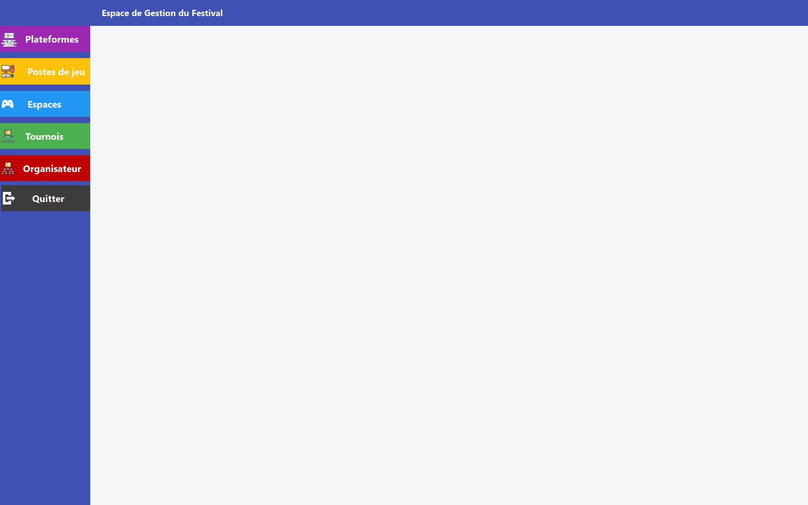

---

### Gestion des espaces

-	Création et gestion des espaces du festival (nom, description, superficie, capacité max).
-	Statut des espaces associés à des tournois.
-	Affichage du nombres de postes fonctionnels
-	En double cliquant sur les postes de jeux associés à l’espace, cela redirige l’utilisateur vers la gestion des postes de jeu, avec le poste de jeu cliqué préchargé pour faciliter la navigation dans l’application.
-	En double cliquant sur les tournois liés à l’espace, redirection vers la gestion des tournois, avec le tournoi cliqué préchargé pour faciliter la navigation dans l’application.
-	Possibilité de filtrer les résultat via la barre de recherche.
-	Pour charger un espace dans le formulaire il suffit de cliquer sur celui souhaité dans la dataGridView (tableau d’affichage de tous les espaces).
-	L’utilisateur peut trier l’ordre d’affichage sur une colonne en cliquant sur le nom de celle.
  
> Contrôle sur le nom de l’espace, pour l’instant, le formatage des postes de jeux repose sur le nom de l’espace, en particulier sur ses trois premières lettres. Si celles-ci correspondent à un autre espace lors de l’ajout ou de la modification du nom de celui-ci.


---

### Gestion des plateformes

-	Création et gestion des plateformes associés aux postes de jeu et aux jeux;
-	Affichage des postes de jeux et des jeux associés à la plateforme lors du chargement de celle-ci dans le formulaire.
-	En double cliquant sur un jeu lié à la plateforme, l’utilisateur est redirigé vers la gestion des jeux, avec le jeu cliqué préchargé pour faciliter la navigation dans l’application.
-	En double cliquant sur un poste de jeu lié à la plateforme, l’utilisateur est redirigé vers la gestion des postes de jeu, avec le poste de jeu cliqué préchargé pour faciliter la navigation dans l’application.
-	Possibilité de filtrer les résultat via la barre de recherche.
-	Pour charger une plateforme dans le formulaire il suffit de cliquer sur celui souhaité dans la dataGridView (tableau d’affichage de toutes les plateformes).
-	L’utilisateur peut trier l’ordre d’affichage sur une colonne en cliquant sur le nom de celle-ci.


---

### Gestion des postes de jeu
-	Création et gestion des jeux du festival (Référence, État fonctionnel, plateforme, espace).
-	Affichage des tournois en cours ou à venir associés à l'espace. Cela permet de savioir si le poste de jeu est actuelelemnt occupé
-	En double cliquant sur un tournoi lié à l'espace du poste de jeu, l’utilisateur est redirigé vers la gestion des tornois, avec le tournoi cliqué préchargé pour faciliter la navigation dans l’application.
-	En double cliquant sur l'espace du poste de jeu dans la dataGridView, l’utilisateur est redirigé vers la gestion des espaces, avec l'espace cliqué préchargé pour faciliter la navigation dans l’application.
-	Indication du nobres de postes de jeu fonctionnels.
-	Pour charger un poste de jeu dans le formulaire il suffit de cliquer sur celui souhaité dans la dataGridView (tableau d’affichage de tou sles postes de jeu).
-	L’utilisateur peut trier l’ordre d’affichage sur une colonne en cliquant sur le nom de celle.
  
> La référence du poste de jeu est formater automatiquement garantissement un meilleur suivi des postes de jeu. Elle n'est pas modifiable par l'organisateur. Ainsi un poste de jeu aura toujours la même plateforme et le même espace.


---


### Gestion des jeux

-	Création et gestion des jeux du festival (jeu, plateforme, date de début, date de fin).
-	Possibilité de filtrer les résultat via la barre de recherche.
-	Pour charger un jeu/plateforme soumis aux vote dans le formulaire il suffit de cliquer sur celui souhaité dans la dataGridView (tableau d’affichage de tous les binomes soumis aux votes).
-	L’utilisateur peut trier l’ordre d’affichage sur une colonne en cliquant sur le nom de celle-ci.


---

### Gestion des tournois
-	Création et gestion des tournois du festival (nom, description, date et heure, durée prévue, jeu, espace, statut, nombre de participants max, nombre de participants inscrit).
-	Affichage du nombres d'inscrit au tournois
-	En double cliquant sur le jeu associé au tournoi dans la dataGridView, cela redirige l’utilisateur vers la gestion des jeux, avec le jeu cliqué préchargé pour faciliter la navigation dans l’application.
-	En double cliquant sur l'espace associé au tournoi dans la dataGridView, cela redirige l’utilisateur vers la gestion des espaces, avec l'espace cliqué préchargé pour faciliter la navigation dans l’application.
-	Possibilité de filtrer les résultat via la barre de recherche.
-	Pour charger un espace dans le formulaire il suffit de cliquer sur celui souhaité dans la dataGridView (tableau d’affichage de tous les espaces).
-	L’utilisateur peut trier l’ordre d’affichage sur une colonne en cliquant sur le nom de celle.

> Le statut du tournoi est géré automatiquement par le code métier, en conséquent l'organisateur ne peut pas le modifier


---

### Gestion des participants
-	Création et gestion des participations des utilisateurs aux tournois proposés durant le festival :
  -	Affichage de la participation, (id du tournoi associé à l’id de l’utilisateur) ;
  -	Saisie du rang et du score final par l’organisateur une fois le tournoi terminé ;
  -	Indication si un lot a été remis à l’utilisateur ;
  -	Affichage de l’évaluation et du commentaire du participants une fois le tournoi terminé.
-	Affichage des autres participations de l’utilisateur.
-	En double cliquant sur un tournoi lié à une participation, l’utilisateur  est redirigé vers la gestion des tournois, avec le tournoi cliqué préchargé pour faciliter la navigation dans l’application.
-	Possibilité de filtrer les résultat via la barre de recherche.
-	Pour charger une participation dans le formulaire il suffit de cliquer sur celui souhaité dans la dataGridView (tableau d’affichage de toutes participations).
-	L’utilisateur peut trier l’ordre d’affichage sur une colonne en cliquant sur le nom de celle.

> Une évaluation est par défaut à 0, si le participant décide de laisser une évaluation à la fin du tournoi, celle-ci doit au moins valoir 1 pour la considérer comme modifier par le participant.
> De même pour le commentaire par défaut, une chaîne de charactère vide "".


---

### Gestion des binômes jeu/plateforme ouverts aux votes


---

### Gestion des lots


---

### Gestion des composants des lots


---

### Gestion des organisateurs


